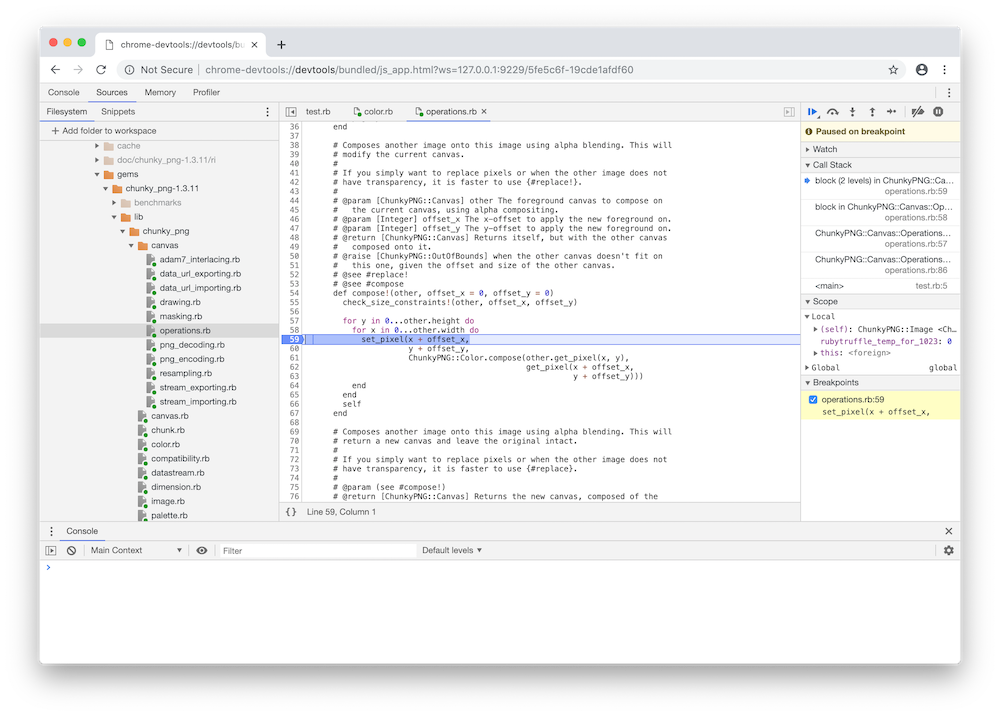
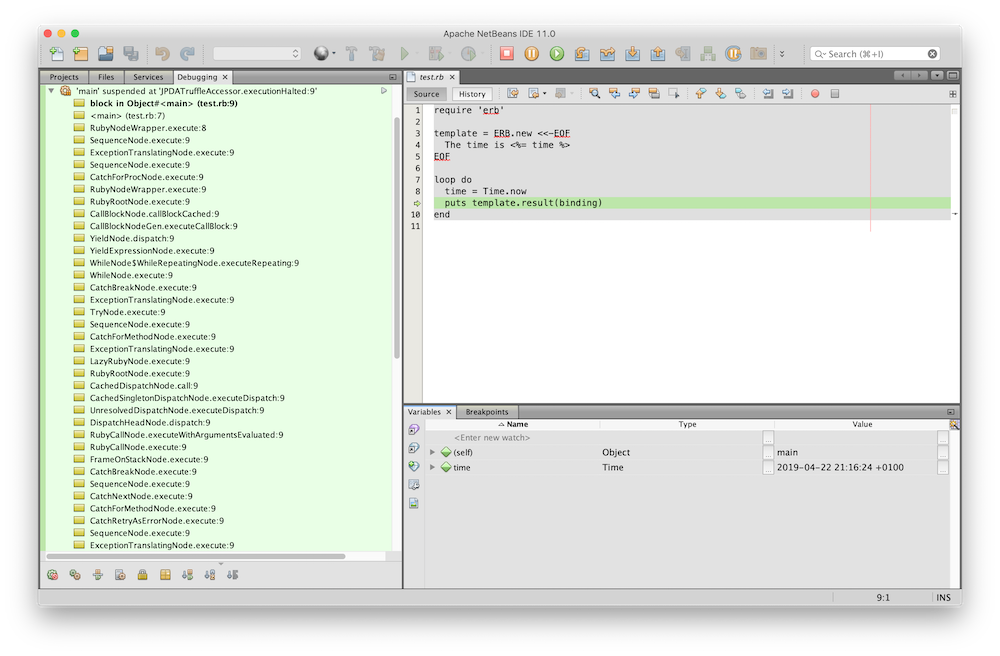

# Development Tools for Ruby

TruffleRuby ships with tools automatically provided by GraalVM. Run `--help:tools` to see a full list of options.

The following program is used for illustration:

```ruby
require 'chunky_png'

a = ChunkyPNG::Image.from_file('a.png')
b = ChunkyPNG::Image.from_file('b.png')
c = a.compose(b, 0, 0)
c.save('c.png')
```

## VisualVM

You need to use the `--jvm` runtime configuration and [install GraalVM](installing-graalvm.md) to use VisualVM.

VisualVM is a GUI with many tools:

* monitoring such as CPU usage, heap size, time spent in GC, etc (tab: Monitor)
* capturing and exploring heap dumps (tab: Monitor)
* a list of threads and their status, and thread dumps (tab: Threads)
* CPU and memory sampling profilers at the Java level (tab: Sampler)
* a CPU sampling profiler at the **Ruby** level (tab: Polyglot Sampler)

There is more documentation about VisualVM on the [GraalVM website](https://www.graalvm.org/tools/visualvm/).

## Profiling

### CPU Tracer

The CPU tracer records the number of times methods, blocks, or statements that are run, and prints a histogram.
Enable it with `--cputracer`:

```shell
-----------------------------------------------------------------------------------------------------------------------------------
Tracing Histogram. Counted a total of 41663 element executions.
  Total Count: Number of times the element was executed and percentage of total executions.
  Interpreted Count: Number of times the element was interpreted and percentage of total executions of this element.
  Compiled Count: Number of times the compiled element was executed and percentage of total executions of this element.
-----------------------------------------------------------------------------------------------------------------------------------
 Name                                               |          Total Count |    Interpreted Count |       Compiled Count | Location
-----------------------------------------------------------------------------------------------------------------------------------
 ChunkyPNG::Color#a                                 |          6474  15.5% |          6474 100.0% |             0   0.0% | chunky_png/color.rb~296-298:12189-12237
 block in ChunkyPNG::Canvas::PNGDecoding#decode_png_str_scanline_paeth |          5248  12.6% |          5248 100.0% |             0   0.0% | chunky_png/canvas/png_decoding.rb~476:25098-25131
 ChunkyPNG::Color#int8_mult                         |          3619   8.7% |          3619 100.0% |             0   0.0% | chunky_png/color.rb~344-347:13821-13900
 ChunkyPNG::Canvas#width                            |          3205   7.7% |          3205 100.0% |             0   0.0% | chunky_png/canvas.rb~50:1853-1874
 block in ChunkyPNG::Canvas::PNGEncoding#encode_png_str_scanline_up |          3072   7.4% |          3072 100.0% |             0   0.0% | chunky_png/canvas/png_encoding.rb~404:20111-20145
 ChunkyPNG::Canvas#get_pixel                        |          2048   4.9% |          2048 100.0% |             0   0.0% | chunky_png/canvas.rb~184-186:7144-7203
 ChunkyPNG::Color#opaque?                           |          1872   4.5% |          1872 100.0% |             0   0.0% | chunky_png/color.rb~304-306:12410-12468
 ChunkyPNG::Color#fully_transparent?                |          1500   3.6% |          1500 100.0% |             0   0.0% | chunky_png/color.rb~327-329:13138-13207
 block in ChunkyPNG::Canvas::PNGDecoding#decode_png_str_scanline_up |          1408   3.4% |          1408 100.0% |             0   0.0% | chunky_png/canvas/png_decoding.rb~453:24009-24042
 block in ChunkyPNG::Canvas::PNGDecoding#decode_png_str_scanline_sub |          1280   3.1% |          1280 100.0% |             0   0.0% | chunky_png/canvas/png_decoding.rb~443:23517-23550
 ChunkyPNG::Color#b                                 |          1037   2.5% |          1037 100.0% |             0   0.0% | chunky_png/color.rb~288-290:11969-12024
 ChunkyPNG::Color#r                                 |          1036   2.5% |          1036 100.0% |             0   0.0% | chunky_png/color.rb~272-274:11534-11590
 ChunkyPNG::Color#g                                 |          1035   2.5% |          1035 100.0% |             0   0.0% | chunky_png/color.rb~280-282:11752-11808
 ChunkyPNG::Color#compose_quick                     |          1024   2.5% |          1024 100.0% |             0   0.0% | chunky_png/color.rb~358-368:14300-14740
 ChunkyPNG::Canvas#set_pixel                        |          1024   2.5% |          1024 100.0% |             0   0.0% | chunky_png/canvas.rb~149-151:5706-5780
 block (2 levels) in ChunkyPNG::Canvas::Operations#compose! |          1024   2.5% |          1024 100.0% |             0   0.0% | chunky_png/canvas/operations.rb~58:2331-2367
 block in ChunkyPNG::Palette#opaque?                |           848   2.0% |           848 100.0% |             0   0.0% | chunky_png/palette.rb~89:3319-3361
 SortedSet#add                                      |           848   2.0% |           848 100.0% |             0   0.0% | lib/mri/set.rb~741-745:1000-1169
 ChunkyPNG::Color#rgba                              |           518   1.2% |           518 100.0% |             0   0.0% | chunky_png/color.rb~100-102:3905-3973
 block in ChunkyPNG::Canvas::PNGDecoding#decode_png_str_scanline_average |           256   0.6% |           256 100.0% |             0   0.0% | chunky_png/canvas/png_decoding.rb~464:24513-24546
 rb_str_new                                         |           199   0.5% |           199 100.0% |             0   0.0% | src/main/c/cext/ruby.c~837:23634-23684
 is_managed_rstring_ptr                             |           193   0.5% |           193 100.0% |             0   0.0% | src/main/c/cext/ruby.c~832:23499-23538
 is_rstring_ptr                                     |           193   0.5% |           193 100.0% |             0   0.0% | src/main/c/cext/ruby.c~828:23430-23461
 strlen                                             |           190   0.5% |           190 100.0% |             0   0.0% | string.c~56:0
 rb_str_new_cstr                                    |           190   0.5% |           190 100.0% |             0   0.0% | src/main/c/cext/ruby.c~858:24268-24310
 RB_NIL_P                                           |           138   0.3% |           138 100.0% |             0   0.0% | src/main/c/cext/ruby.c~413:11068-11094
 ```

Note how the C function `strlen` and the C preprocessor macro `RB_NIL_P` show up, being called by the `zlib` C extension.

### CPU Sampler

The CPU tracer records the cumulative time spent executing methods, blocks, or statements, and prints a histogram. Enable it with `--cpusampler`:

```shell
---------------------------------------------------------------------------------------------------------------------------------------------------------------------------
Sampling Histogram. Recorded 3895 samples with period 1ms.
  Self Time: Time spent on the top of the stack.
  Total Time: Time spent somewhere on the stack.
  Opt %: Percent of time spent in compiled and therefore non-interpreted code.
---------------------------------------------------------------------------------------------------------------------------------------------------------------------------
 Thread: Thread[main,5,main]
 Name                                                                                |      Total Time     |  Opt % ||       Self Time     |  Opt % | Location
---------------------------------------------------------------------------------------------------------------------------------------------------------------------------
 <main>                                                                              |       3635ms  93.3% |   0.0% ||       1086ms  27.9% |   0.0% | test.rb~1-6:0-140
 <top (required)>                                                                    |       1068ms  27.4% |   0.0% ||        708ms  18.2% |   0.0% | chunky_png.rb~1-179:0-5528
 block in ChunkyPNG::Canvas::PNGEncoding#encode_png_str_scanline_up                  |        643ms  16.5% |   0.0% ||        643ms  16.5% |   0.0% | chunky_png/canvas/png_encoding.rb~404:20111-20145
 __sulong_dispose_context                                                            |        260ms   6.7% |   0.0% ||        257ms   6.6% |   0.0% | sulong_dispose_context.c~33:0
 block in ChunkyPNG::Canvas::PNGDecoding#decode_png_str_scanline_paeth               |         58ms   1.5% |   0.0% ||         58ms   1.5% |   0.0% | chunky_png/canvas/png_decoding.rb~476:25098-25131
 do_checksum                                                                         |         77ms   2.0% |   0.0% ||         47ms   1.2% |   0.0% | src/main/c/zlib/zlib.c~389:12721-12796
 ChunkyPNG::Palette#initialize                                                       |         52ms   1.3% |   0.0% ||         41ms   1.1% |   0.0% | chunky_png/palette.rb~21-24:954-1074
 block in Gem::Specification.load                                                    |         39ms   1.0% |   0.0% ||         39ms   1.0% |   0.0% | bigdecimal-1.4.1.gemspec~5:126-154
 rb_define_method                                                                    |         50ms   1.3% |   0.0% ||         36ms   0.9% |   0.0% | src/main/c/cext/ruby.c~2185:61849-61941
 rb_tr_init                                                                          |         44ms   1.1% |   0.0% ||         34ms   0.9% |   0.0% | src/main/c/cext/ruby.c~93:2351-2384
 <top (required)>                                                                    |         42ms   1.1% |   0.0% ||         33ms   0.8% |   0.0% | chunky_png/canvas.rb~1-372:0-13593
 __sulong_byte_array_to_native                                                       |         30ms   0.8% |   0.0% ||         30ms   0.8% |   0.0% | crt0.c~59:0
 rb_str_new                                                                          |         33ms   0.8% |   0.0% ||         29ms   0.7% |   0.0% | src/main/c/cext/ruby.c~837:23634-23684
 __sulong_init_context                                                               |         68ms   1.7% |   0.0% ||         26ms   0.7% |   0.0% | crt0.c~80:0
 Init_zlib                                                                           |        145ms   3.7% |   0.0% ||         24ms   0.6% |   0.0% | src/main/c/zlib/zlib.c~4465:112360-112374
 rb_zlib_crc32                                                                       |        101ms   2.6% |   0.0% ||         24ms   0.6% |   0.0% | src/main/c/zlib/zlib.c~473:14760-14808
 rb_data_typed_object_wrap                                                           |         21ms   0.5% |   0.0% ||         21ms   0.5% |   0.0% | src/main/c/cext/ruby.c~2834:79544-79639
 rb_tr_load_library                                                                  |         22ms   0.6% |   0.0% ||         20ms   0.5% |   0.0% | src/main/c/cext/ruby.c~2906:81858-81897
 ChunkyPNG::Canvas::PNGEncoding#encode_png_str_scanline_up                           |        662ms  17.0% |   0.0% ||         19ms   0.5% |   0.0% | chunky_png/canvas/png_encoding.rb~403-409:20027-20347
 rb_define_class_id_under                                                            |         18ms   0.5% |   0.0% ||         18ms   0.5% |   0.0% | src/main/c/cext/ruby.c~2165:61106-61178
 ChunkyPNG::Chunk.read                                                               |        137ms   3.5% |   0.0% ||         17ms   0.4% |   0.0% | chunky_png/chunk.rb~18-26:783-1054
 Datastream                                                                          |         15ms   0.4% |   0.0% ||         15ms   0.4% |   0.0% | chunky_png/datastream.rb~11:364-381
 ChunkyPNG::Color#compose_quick                                                      |         37ms   0.9% |   0.0% ||         14ms   0.4% |   0.0% | chunky_png/color.rb~358-368:14300-14740
 rb_deflate_s_deflate                                                                |         27ms   0.7% |   0.0% ||         13ms   0.3% |   0.0% | src/main/c/zlib/zlib.c~1622:44042-44097
 ChunkyPNG::Canvas::PNGDecoding#decode_png_str_scanline_paeth                        |         71ms   1.8% |   0.0% ||         13ms   0.3% |   0.0% | chunky_png/canvas/png_decoding.rb~475-488:25010-25650
 ChunkyPNG::Palette.from_canvas                                                      |         64ms   1.6% |   0.0% ||         12ms   0.3% |   0.0% | chunky_png/palette.rb~63-68:2377-2629
 __sulong_byte_arrays_to_native                                                      |         42ms   1.1% |   0.0% ||         12ms   0.3% |   0.0% | crt0.c~69:0
 ChunkyPNG::Chunk::ImageData.combine_chunks                                          |        167ms   4.3% |   0.0% ||         12ms   0.3% |   0.0% | chunky_png/chunk.rb~247-253:9766-9980
 rb_inflate_initialize                                                               |         19ms   0.5% |   0.0% ||         12ms   0.3% |   0.0% | src/main/c/zlib/zlib.c~1887:51522-51576
 strlen                                                                              |         12ms   0.3% |   0.0% ||         12ms   0.3% |   0.0% | string.c~56:0
 zstream_run                                                                         |         76ms   2.0% |   0.0% ||         12ms   0.3% |   0.0% | src/main/c/zlib/zlib.c~1024:27867-27929
```

By default you see this histogram, but you can also see a call tree with `--cpusampler.Output=calltree`.

```shell
-----------------------------------------------------------------------------------------------------------------------------------------------------------------------------------
Sampling CallTree. Recorded 3102 samples with period 1ms.
  Self Time: Time spent on the top of the stack.
  Total Time: Time spent somewhere on the stack.
  Opt %: Percent of time spent in compiled and therefore non-interpreted code.
-----------------------------------------------------------------------------------------------------------------------------------------------------------------------------------
 Thread: Thread[main,5,main]
 Name                                                                                        |      Total Time     |  Opt % ||       Self Time     |  Opt % | Location
-----------------------------------------------------------------------------------------------------------------------------------------------------------------------------------
  ChunkyPNG::Canvas::PNGEncoding#save                                                        |        582ms  18.8% |   0.0% ||          5ms   0.2% |   0.0% | chunky_png/canvas/png_encoding.rb~42-44:1754-1871
   block in ChunkyPNG::Canvas::PNGEncoding#save                                              |        577ms  18.6% |   0.0% ||          0ms   0.0% |   0.0% | chunky_png/canvas/png_encoding.rb~43:1797-1861
    ChunkyPNG::Canvas::PNGEncoding#write                                                     |        577ms  18.6% |   0.0% ||          0ms   0.0% |   0.0% | chunky_png/canvas/png_encoding.rb~34-36:1430-1521
     ChunkyPNG::Image#to_datastream                                                          |        571ms  18.4% |   0.0% ||          0ms   0.0% |   0.0% | chunky_png/image.rb~61-65:2314-2447
      ChunkyPNG::Canvas::PNGEncoding#to_datastream                                           |        569ms  18.3% |   0.0% ||          1ms   0.0% |   0.0% | chunky_png/canvas/png_encoding.rb~74-89:3715-4561
       ChunkyPNG::Canvas::PNGEncoding#encode_png_pixelstream                                 |        489ms  15.8% |   0.0% ||          0ms   0.0% |   0.0% | chunky_png/canvas/png_encoding.rb~153-165:7702-8570
        ChunkyPNG::Canvas::PNGEncoding#encode_png_image_without_interlacing                  |        489ms  15.8% |   0.0% ||          0ms   0.0% |   0.0% | chunky_png/canvas/png_encoding.rb~172-176:8925-9195
         ChunkyPNG::Canvas::PNGEncoding#encode_png_image_pass_to_stream                      |        489ms  15.8% |   0.0% ||          3ms   0.1% |   0.0% | chunky_png/canvas/png_encoding.rb~203-231:10502-11685
          block in ChunkyPNG::Canvas::PNGEncoding#encode_png_image_pass_to_stream            |        481ms  15.5% |   0.0% ||          0ms   0.0% |   0.0% | chunky_png/canvas/png_encoding.rb~225:11418-11456
           ChunkyPNG::Canvas::PNGEncoding#encode_png_str_scanline_up                         |        481ms  15.5% |   0.0% ||         11ms   0.4% |   0.0% | chunky_png/canvas/png_encoding.rb~403-409:20027-20347
            block in ChunkyPNG::Canvas::PNGEncoding#encode_png_str_scanline_up               |        470ms  15.2% |   0.0% ||        470ms  15.2% |   0.0% | chunky_png/canvas/png_encoding.rb~404:20111-20145
          block in ChunkyPNG::Canvas::PNGEncoding#encode_png_image_pass_to_stream            |          5ms   0.2% |   0.0% ||          1ms   0.0% |   0.0% | chunky_png/canvas/png_encoding.rb~219:11252-11284
           ChunkyPNG::Canvas::PNGEncoding#encode_png_pixels_to_scanline_truecolor_8bit       |          4ms   0.1% |   0.0% ||          4ms   0.1% |   0.0% | chunky_png/canvas/png_encoding.rb~236-238:11896-12009
       ChunkyPNG::Canvas::PNGEncoding#determine_png_encoding                                 |         60ms   1.9% |   0.0% ||          2ms   0.1% |   0.0% | chunky_png/canvas/png_encoding.rb~102-145:5085-7303
        ChunkyPNG::Canvas#palette                                                            |         51ms   1.6% |   0.0% ||          0ms   0.0% |   0.0% | chunky_png/canvas.rb~268-270:10089-10154
         ChunkyPNG::Palette.from_canvas                                                      |         51ms   1.6% |   0.0% ||          9ms   0.3% |   0.0% | chunky_png/palette.rb~63-68:2377-2629
          ChunkyPNG::Palette#initialize                                                      |         42ms   1.4% |   0.0% ||         30ms   1.0% |   0.0% | chunky_png/palette.rb~21-24:954-1074
           SortedSet#initialize                                                              |         12ms   0.4% |   0.0% ||          0ms   0.0% |   0.0% | lib/mri/set.rb~726-729:725-819
            SortedSet#merge                                                                  |         12ms   0.4% |   0.0% ||          6ms   0.2% |   0.0% | lib/mri/set.rb~770-773:1759-1847
             SortedSet#add                                                                   |          6ms   0.2% |   0.0% ||          6ms   0.2% |   0.0% | lib/mri/set.rb~741-745:1000-1169
        ChunkyPNG::Palette#best_color_settings                                               |          7ms   0.2% |   0.0% ||          0ms   0.0% |   0.0% | chunky_png/palette.rb~195-211:7150-7613
         ChunkyPNG::Palette#opaque?                                                          |          3ms   0.1% |   0.0% ||          0ms   0.0% |   0.0% | chunky_png/palette.rb~88-90:3303-3369
          SortedSet#each                                                                     |          3ms   0.1% |   0.0% ||          2ms   0.1% |   0.0% | lib/mri/set.rb~775-779:1850-2004
           block in ChunkyPNG::Palette#opaque?                                               |          1ms   0.0% |   0.0% ||          0ms   0.0% |   0.0% | chunky_png/palette.rb~89:3319-3361
            ChunkyPNG::Color#opaque?                                                         |          1ms   0.0% |   0.0% ||          0ms   0.0% |   0.0% | chunky_png/color.rb~304-306:12410-12468
             ChunkyPNG::Color#a                                                              |          1ms   0.0% |   0.0% ||          1ms   0.0% |   0.0% | chunky_png/color.rb~296-298:12189-12237
         ChunkyPNG::Palette#black_and_white?                                                 |          3ms   0.1% |   0.0% ||          1ms   0.0% |   0.0% | chunky_png/palette.rb~104-106:3841-3940
          SortedSet#each                                                                     |          2ms   0.1% |   0.0% ||          1ms   0.0% |   0.0% | lib/mri/set.rb~775-779:1850-2004
           SortedSet#to_a                                                                    |          1ms   0.0% |   0.0% ||          1ms   0.0% |   0.0% | lib/mri/set.rb~781-784:2007-2116
         ChunkyPNG::Palette#grayscale?                                                       |          1ms   0.0% |   0.0% ||          0ms   0.0% |   0.0% | chunky_png/palette.rb~96-98:3570-3642
          SortedSet#each                                                                     |          1ms   0.0% |   0.0% ||          1ms   0.0% |   0.0% | lib/mri/set.rb~775-779:1850-2004
       ChunkyPNG::Chunk::ImageData.split_in_chunks                                           |         19ms   0.6% |   0.0% ||          7ms   0.2% |   0.0% | chunky_png/chunk.rb~255-259:9983-10267
        rb_deflate_s_deflate                                                                 |         12ms   0.4% |   0.0% ||          4ms   0.1% |   0.0% | src/main/c/zlib/zlib.c~1622:44042-44097
         rb_ensure                                                                           |          5ms   0.2% |   0.0% ||          1ms   0.0% |   0.0% | src/main/c/cext/ruby.c~2107:59266-59360
          deflate_run                                                                        |          4ms   0.1% |   0.0% ||          0ms   0.0% |   0.0% | src/main/c/zlib/zlib.c~1589:43218-43240
           zstream_run                                                                       |          4ms   0.1% |   0.0% ||          0ms   0.0% |   0.0% | src/main/c/zlib/zlib.c~1024:27867-27929
            zstream_append_input                                                             |          1ms   0.0% |   0.0% ||          0ms   0.0% |   0.0% | src/main/c/zlib/zlib.c~827:23738-23804
             rb_str_buf_cat                                                                  |          1ms   0.0% |   0.0% ||          0ms   0.0% |   0.0% | src/main/c/cext/ruby.c~981:27520-27591
              rb_str_cat                                                                     |          1ms   0.0% |   0.0% ||          0ms   0.0% |   0.0% | src/main/c/cext/ruby.c~882:24901-24968
               rb_enc_str_new                                                                |          1ms   0.0% |   0.0% ||          0ms   0.0% |   0.0% | src/main/c/cext/ruby.c~1301:37035-37101
```

### Coverage

The coverage tool reports coverage by statement, line, and root.
*Root* means the root of a function, i.e., how many methods and blocks were covered.
Enable it with `--coverage`:

```shell
-------------------------------------------------------------------------------------------------------------------------------------
Code coverage histogram.
  Shows what percent of each element was covered during execution
-------------------------------------------------------------------------------------------------------------------------------------
 Path                                                                                            |  Statements |    Lines |    Roots
-------------------------------------------------------------------------------------------------------------------------------------
 chunky_png-1.3.11/lib/chunky_png.rb                                                             |     100.00% |  100.00% |  100.00%
 chunky_png-1.3.11/lib/chunky_png/canvas.rb                                                      |      58.40% |   69.41% |   35.90%
 chunky_png-1.3.11/lib/chunky_png/canvas/adam7_interlacing.rb                                    |      28.57% |   50.00% |   28.57%
 chunky_png-1.3.11/lib/chunky_png/canvas/data_url_exporting.rb                                   |      80.00% |   83.33% |   80.00%
 chunky_png-1.3.11/lib/chunky_png/canvas/data_url_importing.rb                                   |      57.14% |   70.00% |   80.00%
 chunky_png-1.3.11/lib/chunky_png/canvas/drawing.rb                                              |       8.28% |   44.02% |   13.33%
 chunky_png-1.3.11/lib/chunky_png/canvas/masking.rb                                              |      28.57% |   51.72% |   44.44%
 chunky_png-1.3.11/lib/chunky_png/canvas/operations.rb                                           |      42.42% |   65.07% |   21.95%
 chunky_png-1.3.11/lib/chunky_png/canvas/png_decoding.rb                                         |      52.84% |   68.27% |   26.98%
 chunky_png-1.3.11/lib/chunky_png/canvas/png_encoding.rb                                         |      44.44% |   62.07% |   40.43%
 chunky_png-1.3.11/lib/chunky_png/canvas/resampling.rb                                           |      17.46% |   48.51% |   25.00%
 chunky_png-1.3.11/lib/chunky_png/canvas/stream_exporting.rb                                     |      61.54% |   72.22% |   44.44%
 chunky_png-1.3.11/lib/chunky_png/canvas/stream_importing.rb                                     |      31.82% |   45.83% |   40.00%
 chunky_png-1.3.11/lib/chunky_png/chunk.rb                                                       |      82.84% |   86.32% |   68.42%
 chunky_png-1.3.11/lib/chunky_png/color.rb                                                       |      41.82% |   59.00% |   33.93%
 chunky_png-1.3.11/lib/chunky_png/compatibility.rb                                               |      75.00% |   66.67% |   75.00%
 chunky_png-1.3.11/lib/chunky_png/datastream.rb                                                  |      83.56% |   87.50% |   80.00%
 chunky_png-1.3.11/lib/chunky_png/dimension.rb                                                   |      42.11% |   62.07% |   23.08%
 chunky_png-1.3.11/lib/chunky_png/image.rb                                                       |      85.00% |   90.32% |   90.00%
 chunky_png-1.3.11/lib/chunky_png/palette.rb                                                     |      41.18% |   63.46% |   42.31%
 chunky_png-1.3.11/lib/chunky_png/point.rb                                                       |      42.86% |   62.96% |   25.00%
 chunky_png-1.3.11/lib/chunky_png/vector.rb                                                      |      40.98% |   63.10% |   10.34%
 chunky_png-1.3.11/lib/chunky_png/version.rb                                                     |     100.00% |  100.00% |  100.00%
-------------------------------------------------------------------------------------------------------------------------------------
```

## Debugging

### Chrome Inspector

GraalVM lets you debug Ruby programs, and any other language supported by GraalVM, using the [Chrome DevTools Protocol](https://chromedevtools.github.io/devtools-protocol/) to attach to debuggers such as [Chrome Developer Tools](https://developers.google.com/web/tools/chrome-devtools/).

Run with `--inspect`, open the given URL in Chrome, drag your file system into the sources list, and then set a breakpoint and resume execution.
Having the debugger attached and simple breakpoints set should not reduce performance.



### NetBeans

You can also debug GraalVM languages using NetBeans.
Run with `--jvm --vm.agentlib:jdwp=transport=dt_socket,server=y,address=8000,suspend=y` and attach to the process as if you were debugging a Java program.
Then click *Toggle pause in GraalVM script* (the pause icon with a *G* superimposed) and break, and you will break into the Ruby code.
You will see Ruby stack frames and local variables rather than Java stack frames and local variables.


